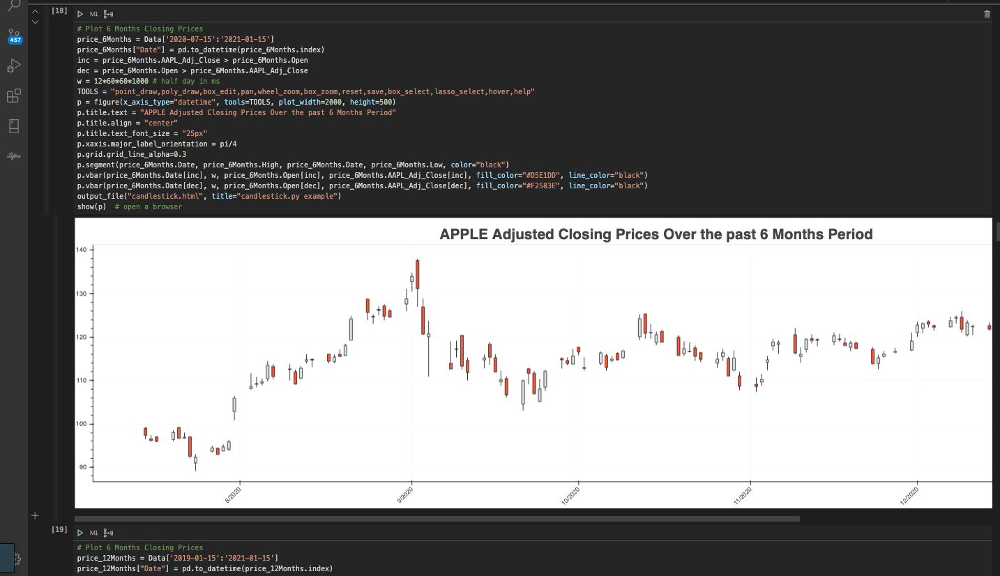
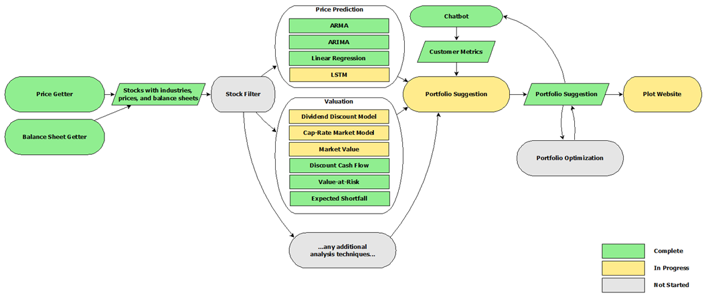

# **Project2**


# **Summary**

The goal of the Litquidity project is to produce an automated portfolio design platform for stock investments.

The framework is intended to provide a springboard for future work including portfolio optimization additional analysis methods.

# **Description**

The full platform solution consists of the following parts:

* Offline Testing
* Deployed Solution
* Documentation

## **Offline Testing**

Testing and R&D was performed in Jupyter notebooks using Pyviz visualizations.



## **Deployed Solution**

The portfolio recommendation is started off with an Amazon Lex chatbot. Answers from the customers are used to drive basic risk and exposure for the portfolio. Backend logic consists of a multi-module Python project executed on an Amazon Lambda instance. Large file storage is supplied by Amazon S3.

The internal logic consists of the following core components:

- Chat bot: 
- External data interfaces
- Price prediction: 
- Company valuation
- Portfolio suggestion function
- Website

Connectivity and implementation status of each component is shown below.

**Platform Architecture - Simple**


## **Documentation**

Documentation includes a PowerPoint presentation and ReadMe.md file.

# **Project Details**

## **Offline Testing**

Offline testing notebooks and data are stored in the `notebooks` directory.

### **CompanyValuations**

*BalanceSheet.ipynb*: Pulls company financial data and computes equity, assets, and liabilities.

*Stock Market and Bitcoin Price Relationship.ipynb*: Pulls S&P 500 and Bitcoin price histories and computes a correlation matrix.

*Valuation Computation.ipynb*: Computes company valuation based on the price-to-sales ratio; prestents the gross profit ratio and price-to-sales ratios to enable an investment decision.

*Value-at-Risk versus Expected Shortfall.ipynb*: Computes value-at-risk (VaR) and expected shortfall (ES) for a company to enhance risk assessment.

### **PriceForecasting**

*Machine_Learning.ipynb*: Implements the LSTM model.

*Portfolio_Analysis.ipynb*: Analyzes price history and uses ARMA, ARIMA, and other models to predict future price movements.

*Portfolio_Optimization.ipynb*: Compares industries and stocks based on annualized returns, volatility, and the Sharpe ratio. The initial industries selected for this comparieson are real estate and communications services industries.

*stock_sentiment.ipynb*: Sentiment is computed for stocks using Natural Language Processing (NLP) techniques.

*stock_sentiment_twitter.ipynb*: Sentiment is computed for stocks using Natural Language Processing (NLP) techniques.

*app.py*: Website component prototype to enable testing interactive plots based on generated data.

Various other data files and files for testing are also listed in the directory.

## **Deployed Solution**

### **Detailed Architecture**

The internal components are shown in the detailed diagram below.

**Platform Architecture - Full**


The Python project is organized into modules underneath the src/main directory.

src/lambda_function.py serves as the launch point and is called by Amazon Lambda.

### **Unit Testing**

Unit tests ensure functionality for critical internal components. Tests are stored in the src/test directory.

One integration test that executes the high-level function is inside src/test_lambda_function.py.

### **Building and Deploying**

The build script `build-and-deploy-aws-package.sh` provides packaging and deployment of the Amazon Lambda function.

During testing a data capacity constraint exists which prevents the deployment step. However the .zip package is manually uploaded to Amazon S3 and linked to the Amazon Lambda function.

### **Implementation Notes**

Platform development remains in constant development and the following notes are relevant:

* Supported securities are those provided by the Fmp Cloud data provider and are not inclusive of all available assets.
* Cryptocurrency integration into the main deployed solution, and integration of additional securities and markets, ramains in progress.

### **External Data APIs**

**Yahoo**

[Pandas DataReader](https://pandas-datareader.readthedocs.io/en/latest/#)

Yahoo provides price history data for stocks on the U.S. market.

**Fmp Cloud**

[Fmp Cloud](https://fmpcloud.io/documentation)

Fmp Cloud is used to acquire financial data including balance sheets.

**Kraken**

[Kraken API](https://www.kraken.com/en-us/features/api)

Kraken provides price history for cryptocurrencies.

## **Documentation**

Documentation items are stored in the following locations:

* **ReadMe.txt**: Provides a project overview.

* **doc/Project2_Presentation_final.pptx**: Presentation describing the project.

# **Configuration**

## **Offline Testing**

Offline testing involved use of Jupyter Lab notebooks and visualizations. Required Python dependencies and installation steps are listed below:

```bash
pip install alpaca-trade-api
pip install asyncio
pip install bokeh
pip install ccxt
pip install dash --upgrade
pip install dash --upgrade
pip install pandas
pip install pandas_datareader
pip install PyPortfolioOpt
pip install PyPortfolioOpt
pip install python-dotenv
pip install requests
pip install sklearn
pip install statsmodels
pip install yahoofinance
```

## **Deployed Solution**

The following Python packages are required to run the source code:

```bash
pip install alpaca-trade-api
pip install pandas
pip install python-dotenv
pip install requests
pip install statsmodels
```

# ToDo

## High Priority

* Ensure DCF and DDM are implemented
* Fix up the portfolio builder to distribute the investment amount into #shares correctly
* Condition data for price prediction models
* Catch exceptions from price prediction models

* In filter, remove items with invalid financial data

* Fix up the composite score calculation to implement basic weighted sum of scores correctly
* Configure proper industry retrieval and handling
* Increase execution speed for testing/demo - Implement Implement use_predefined_test_stock_list in stock filter
* Fix up the portfolio builder to use the customer metrics somehow
* Implement financial data combiner
* Ingest all relevant financial data and merge

## Low-Priority

* Document all functions
* Sanitize chatbot investment amount input
* Apply checks for data types etc. inside all functions
* Bounds testing unit tests


